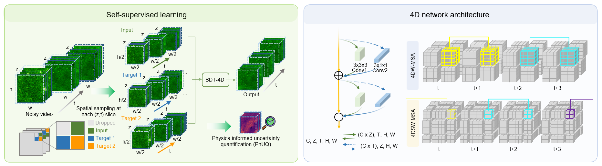

# SDT-4D

## ✨ Method overview

<p align="center">

</p>

Volumetric time-lapse fluorescence microscopy is essential for observing biological structures and dynamics in living systems. However, photon-limited acquisition inherently suffers from severe noise, limiting reliable visualization and quantitative analysis. Here we present SDT-4D, a self-supervised denoising framework for volumetric time-lapse fluorescence microscopy. SDT-4D learns directly from noisy data by integrating lateral, axial and temporal information, restoring weak signals while preserving structural continuity and dynamic fidelity. In volumetric two-photon calcium imaging, SDT-4D achieves state-of-the-art denoising performance and preserves neuronal morphology and calcium dynamics. We demonstrate the utility of SDT-4D in photon-limited intravital experiments, including visualization of immune-cell morphology and migration, tracking of three-dimensional neutrophil dynamics and segmentation of three-dimensional glial-cell branches. We further develop Bayesian SDT-4D to quantify uncertainty without requiring clean reference images, generating pixel-wise confidence maps to assess the reliability of restored images. SDT-4D provides a general framework for restoring and interpreting photon-limited four-dimensional fluorescence microscopy data.

This repository contains the implementation for the paper **“Four-dimensional self-supervised denoising enables high-sensitivity volumetric imaging of biological dynamics.”**
The two main entry points are:

- `train.py`: train without clean targets.
- `test.py`: run denoising with optional ground-truth SNR evaluation.
- `train_UQ.py`: train the uncertainty-quantification (UQ) model.
- `test_UQ.py`: run Monte Carlo UQ inference.

## Data format

Each TIFF file represents one Z slice and must have the following array shape:

```text
(T, H, W)
```

Files are sorted by name and interpreted as consecutive Z slices:

```text
data/sample/
├── z000.tif
├── z001.tif
├── z002.tif
├── z003.tif
└── z004.tif
```

All neighboring TIFF stacks must have the same `(T, H, W)` shape.

## Installation

Python 3.10 or newer is recommended. Install a PyTorch build compatible with your CUDA version, then install the remaining dependencies:

```bash
pip install -r requirements.txt
```

Training requires an NVIDIA GPU. Inference supports both CUDA and CPU, although CPU inference is slow.

## Training 
### 1. Prepare the data  

You can use your own data or download one of the demo data below (*.tif file).
### Datasets

| Data | Pixel size | Volume rate | Size | Download | Description |
| :---- | :--------- | :---------- | :--- | :------- | :---------- |
| Simulated calcium imaging (Noisy) | 1.02 μm | 1 Hz | 29.5 GB | <center>Zenodo repository <a href="https://doi.org/10.5281/zenodo.21960236"></a></center> | Simulated noisy volumetric two-photon calcium imaging data at different SNR levels |
| Simulated calcium imaging (Ground truth) | 1.02 μm | 1 Hz | 29.5 GB | <center>Zenodo repository <a href="https://doi.org/10.5281/zenodo.21912409"></a></center> | Corresponding noise-free ground-truth volumetric two-photon calcium imaging data |

### 2. Start training
```bash
python train.py \
  --data-dir /path/to/train_tiffs \
  --gpu 0 \
  --epochs 100 \
  --patch-x 128 \
  --patch-t 64 \
  --patch-z 5 \
  --train-patches 6000 \
  --output-dir ./pth
```

Multi-GPU training:

```bash
python train.py --data-dir /path/to/train_tiffs --gpu 0,1,2,3
```

Initialize training from an existing checkpoint:

```bash
python train.py \
  --data-dir /path/to/train_tiffs \
  --resume ./pth/example/E_100_Iter_0100.pth
```

Training uses 2×2 spatial subsampling. Therefore, `--patch-x 128` during training normally corresponds to `--patch-x 64` during inference.

Parameter constraints:

- `patch_t` must be a positive multiple of 16.
- `patch_z` must be a positive odd number.
- `patch_x` must be a positive even number.
- `scale_factor` must be greater than zero.
- Training and inference must use matching `patch_t`, `patch_z`, and `bayesian` settings.
- Training coordinates are resampled at the beginning of every epoch.

## Inference without ground truth

For a model stored in `./pth/example/`, pass only `--checkpoint example`. An explicit `.pth` file or directory path is also supported. When a directory is provided, the last checkpoint in filename-sorted order is used by default.

```bash
python test.py \
  --input-dir /path/to/noisy_tiffs \
  --checkpoint example \
  --output-dir ./results \
  --gpu 0 \
  --patch-x 64 \
  --patch-t 64 \
  --patch-z 5
```

Each test run is saved under:

```text
results/DataFolderIs_{data_folder}_{YYYYMMDDHHMM}_ModelFolderIs_{model_folder}/
```

All Z slices are processed by default. Z boundaries use replicated padding. To process selected slices:

```bash
python test.py \
  --input-dir /path/to/noisy_tiffs \
  --checkpoint example \
  --z-indices 0,2,5-8
```

To evaluate every checkpoint in a directory:

```bash
python test.py \
  --input-dir /path/to/noisy_tiffs \
  --checkpoint example \
  --all-checkpoints
```

## Inference with ground truth

Add `--gt-dir` to calculate SNR. Ground-truth files are matched in this order:

1. The same filename as the input TIFF.
2. The input filename with `noisy` replaced by `clean`.
3. A unique TIFF in the GT directory containing the same `depthXXXum` token.

```bash
python test.py \
  --input-dir /path/to/noisy_tiffs \
  --checkpoint example \
  --gt-dir /path/to/clean_tiffs
```

A custom filename template can also be supplied:

```bash
python test.py \
  --input-dir /path/to/noisy_tiffs \
  --checkpoint example \
  --gt-dir /path/to/clean_tiffs \
  --gt-pattern "clean_depth{depth}um_scale0.80_1500frames_preprocessed.tif"
```

Available template fields are `{name}` for the full input filename, `{stem}` for the filename without its extension, and `{depth}` for the value parsed from `depthXXXum`.

Missing GT files do not interrupt inference. Results are still saved, and SNR is skipped for unmatched files. When GT files are matched, metrics are written to `metrics.csv` inside the checkpoint output directory.

## UQ training

The UQ training entry point preserves the original staged objective and model settings. The model uses `embedding_dim=128`, produces mean and raw-variance channels, and trains in two stages:

1. Stage 1 optimizes weighted L1 and L2 mean losses.
2. Stage 2 smoothly adds Gaussian NLL with Poisson-Gaussian observation variance. Alpha and beta can be learned as positive global parameters.

Training requires at least `patch_z` consecutive TIFF files and an NVIDIA GPU:

```bash
python train_UQ.py \
  --datasets_folder /path/to/train_tiffs \
  --GPU 0 \
  --n_epochs 200 \
  --patch_x 128 \
  --patch_t 64 \
  --patch_z 5 \
  --train_datasets_size 6000
```

The UQ script intentionally retains the original checkpoint directory convention:

```text
pth/{data_folder}_{YYYYMMDDHHMM}_bayesian_mu2nll_smooth/
├── para.yaml
├── ab_values.txt
├── E_001_Iter_NNNN.pth
└── ...
```

`ab_values.txt` records the effective PG alpha and beta at every epoch. Checkpoints contain model weights, matching the original format. The UQ model architecture differs from the baseline model, so baseline and UQ checkpoints are not interchangeable.

Useful staged-training controls include:

- `--stage1_epochs`: number of mean-only epochs.
- `--lambda_mu_start` and `--lambda_mu_end`: L1 schedule.
- `--mu_l2_w_stage1_start`, `--mu_l2_w_stage1_end`, and `--mu_l2_w_stage2`: L2 weights.
- `--pg_scale_start`, `--pg_scale_end`, and `--pg_ramp_end_epoch`: PG variance schedule.
- `--nll_ramp_end_epoch`: NLL blend schedule.
- `--pg_learn_ab`: enable learnable alpha and beta.
- `--pg_ab_init_mode`: use `fixed`, `zeros`, or Stage 1 regression initialization.

## UQ inference

Use the UQ test entry point with a folder produced by UQ training. Training uses 2×2 spatial subsampling, so a training patch size of 128 normally corresponds to an inference patch size of 64.

```bash
python test_UQ.py \
  --datasets_folder /path/to/noisy_tiffs \
  --denoise_model example_bayesian_mu2nll_smooth \
  --pth_path ./pth \
  --output_path ./results \
  --GPU 0 \
  --patch_x 64 \
  --patch_t 64 \
  --patch_z 5 \
  --mc_samples 3
```

By default, UQ inference uses the latest filename-sorted checkpoint and tests every Z slice. Boundary slices use replicated Z neighbors, so the first and last TIFF files are also processed. Use `--z_edge_mode reflect` for reflected neighbors or `--z_edge_mode skip` to skip incomplete Z windows. Select another checkpoint range or specific Z centers when needed:

```bash
python test_UQ.py \
  --datasets_folder /path/to/noisy_tiffs \
  --denoise_model example_bayesian_mu2nll_smooth \
  --checkpoint_slice "::1" \
  --selected_z_test all
```

The default ground-truth directory and filename pattern match the original UQ test script. Override both options for another dataset:

```bash
python test_UQ.py \
  --datasets_folder /path/to/noisy_tiffs \
  --denoise_model example_bayesian_mu2nll_smooth \
  --gt_dir /path/to/clean_tiffs \
  --gt_pattern "clean_depth{depth}um_scale0.80_1500frames_preprocessed.tif"
```

Pass `--gt_dir ""` to disable ground-truth evaluation. Missing ground-truth files do not interrupt UQ inference.

The UQ result root retains the original naming convention:

```text
results/DataFolderIs_{data_folder}_{YYYYMMDDHHMM}_ModelFolderIs_{model_folder}/
└── E_NNN_Iter_NNNN/
    ├── {input}_{checkpoint}_output.tif
    ├── {input}_{checkpoint}_output_aleatoric.tif
    ├── {input}_{checkpoint}_output_epistemic.tif
    ├── {input}_{checkpoint}_output_confidence.tif
    ├── {input}_{checkpoint}_output_abs_error.tif
    ├── {input}_{checkpoint}_output_reliability_v2.png
    └── {input}_{checkpoint}_output_reliability_v2.csv
```

The main output is the MC mean. The aleatoric map is the mean predicted standard deviation, the epistemic map is the standard deviation of MC mean predictions, and the confidence map estimates the Gaussian probability of falling within `mean ± epsilon`. Absolute-error and reliability files are produced only when matching ground truth is available.

`--save_dtype`, `--save_scale_mode`, and `--tiff_compress` control UQ map storage. The main denoised result always remains float32. Integer UQ maps include the applied maximum in TIFF metadata.

## Automatic epsilon selection

`select_epsilon.py` combines confidence-distribution generation and unsupervised epsilon ranking. It requires an aleatoric standard-deviation map produced by `test_UQ.py` and does not require ground truth:

```bash
python select_epsilon.py \
  --aleatoric /path/to/checkpoint_results \
  --epsilons 2,5,15,25,30,40 \
  --out_dir ./epsilon_selection
```

When a directory is provided, the latest `*_aleatoric.tif` file is selected. Total predictive uncertainty can also be evaluated:

```bash
python select_epsilon.py \
  --aleatoric /path/to/result_aleatoric.tif \
  --epistemic /path/to/result_epistemic.tif \
  --use_total
```

The script writes the confidence histogram, epsilon metrics, selected value, selection-score plot, and confidence-interval mass plot. The selected value maximizes a heuristic score that rewards confidence mass between 0.6 and 0.9 while penalizing low confidence, saturation, and an extreme mean confidence. This is an unsupervised distribution-shape heuristic, not a substitute for ground-truth calibration.

## Project structure

```text
.
├── SDT4D/
│   ├── __init__.py
│   ├── model.py
│   ├── Mainframe_Ztconv.py
│   └── swin4d_transformer_ver7.py
├── common.py
├── data.py
├── sampling.py
├── uq_data.py
├── train.py
├── test.py
├── train_UQ.py
├── test_UQ.py
├── select_epsilon.py
├── requirements.txt
└── .gitignore
```

Model checkpoints, TIFF data, and generated results are excluded by `.gitignore`. Before publishing, add an appropriate `LICENSE`, complete paper citation, author information, and a download link for pretrained checkpoints.
